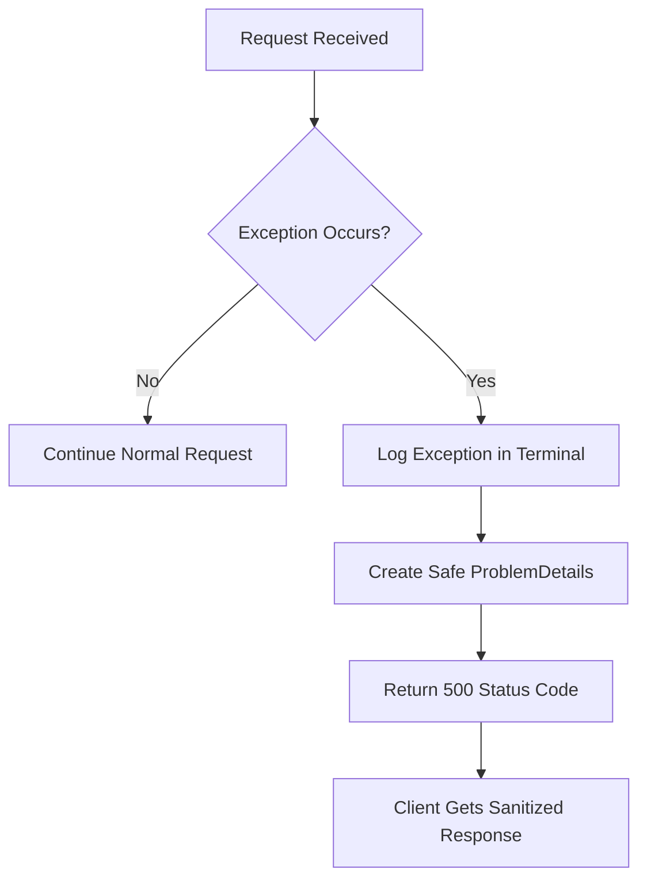

# Exception Handling in .NET Applications

## Understanding Errors vs Exceptions

 there is a key difference:
- Exceptions occur when something unexpected happens in the system
- Errors are different because they're expected, like when a user enters a wrong password

## The Problem (As Demonstrated)

The notes showed an example in the AuthController with a login endpoint where throwing an exception revealed a security issue:

```csharp
[HttpPost("")]
public async Task<IActionResult> LoginAsync([FromBody] LoginRequest request,CancellationToken cancellationToken)
{
    throw new Exception("My exception");
    var authResult = await _authService.GetTokenasync(request.Email,request.Password,cancellationToken);

    return authResult.IsSuccess
        ? Ok(authResult.Value)
        : authResult.ToProblem(StatusCodes.Status400BadRequest); 
}
```

When tested in Postman, this exposed:
- The stack trace
- Controller information
- Method details with parameters
- Code implementation details

As noted, this is a significant security risk in production as it reveals:
- Use of .NET
- AuthController existence
- LoginAsync method details
- Other system implementation details that could be exploited

## The Solution (Pre-.NET 8)

The notes described implementing an ExceptionMiddleware as the solution:

1. Create folder: `Middleware/ExceptionHandlingMiddleware`
2. Implement custom middleware:

```csharp
public class ExceptionHandlingMiddleware
{
    private readonly RequestDelegate _next;
    private readonly ILogger<ExceptionHandlingMiddleware> _logger;

    public ExceptionHandlingMiddleware(RequestDelegate next,ILogger<ExceptionHandlingMiddleware> logger)
    {
        _next = next;
        _logger = logger;
    }

    public async Task InvokeAsync(HttpContext httpContext)
    {
        try
        {
            await _next(httpContext);
        }
        catch(Exception exception)
        {
            _logger.LogError(exception, "Something went wrong: {Message}",exception.Message);
            
            var problemDetails = new ProblemDetails
            {
                Status = StatusCodes.Status500InternalServerError,
                Title = "Internal Server Error",
                Type = "https://datatracker.ietf/doc/html/rfc7231#section-6.6.1"
            };
            
            httpContext.Response.StatusCode = StatusCodes.Status500InternalServerError;
            await httpContext.Response.WriteAsJsonAsync(problemDetails);
        }
    }
}
```

The notes explained that the middleware:
- Tries to continue the request normally
- Catches any exceptions
- Logs them for development visibility
- Returns a sanitized ProblemDetails response

## Pipeline Integration

As shown in the notes, add the middleware to Program.cs:

```csharp
var app = builder.Build();

if(app.Environment.IsDevelopment())
{
    app.UseSwagger();
    app.UseSwaggerUI();
}

app.UseHttpsRedirection();
app.UseCors();
app.UseAuthorization();
app.MapControllers();
app.UseMiddleware<ExceptionHandlingMiddleware>();
app.Run();
```

## Result

The notes demonstrated that the new response is clean and safe for production:

```json
{
    "type": "https://datatracker.ietf.org/doc/html/rfc7231#section-6.6.1",
    "title": "Internal Server Error",
    "status": 500
}
```

Key benefits mentioned:
- No sensitive details exposed
- Error details still available in terminal logs
- Clients receive standardized, safe responses

## Exception Flow Diagram



