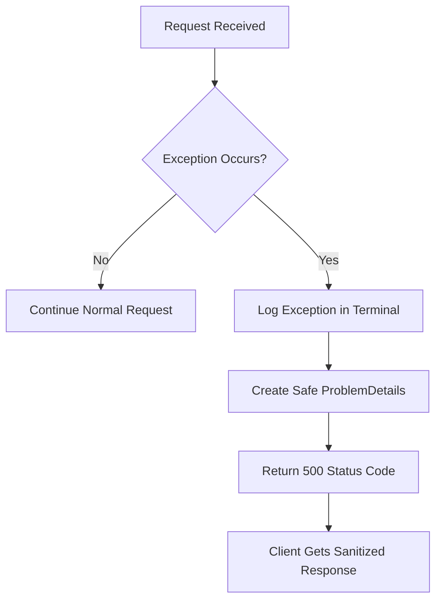
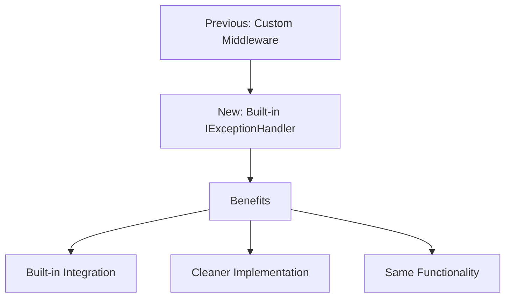

# Exception Handling in .NET Applications

## Understanding Errors vs Exceptions

 there is a key difference:
- Exceptions occur when something unexpected happens in the system
- Errors are different because they're expected, like when a user enters a wrong password

## The Problem (As Demonstrated)

The notes showed an example in the AuthController with a login endpoint where throwing an exception revealed a security issue:

```csharp
[HttpPost("")]
public async Task<IActionResult> LoginAsync([FromBody] LoginRequest request,CancellationToken cancellationToken)
{
    throw new Exception("My exception");
    var authResult = await _authService.GetTokenasync(request.Email,request.Password,cancellationToken);

    return authResult.IsSuccess
        ? Ok(authResult.Value)
        : authResult.ToProblem(StatusCodes.Status400BadRequest); 
}
```

When tested in Postman, this exposed:
- The stack trace
- Controller information
- Method details with parameters
- Code implementation details

As noted, this is a significant security risk in production as it reveals:
- Use of .NET
- AuthController existence
- LoginAsync method details
- Other system implementation details that could be exploited

## The Solution (Pre-.NET 8)

The notes described implementing an ExceptionMiddleware as the solution:

1. Create folder: `Middleware/ExceptionHandlingMiddleware`
2. Implement custom middleware:

```csharp
public class ExceptionHandlingMiddleware
{
    private readonly RequestDelegate _next;
    private readonly ILogger<ExceptionHandlingMiddleware> _logger;

    public ExceptionHandlingMiddleware(RequestDelegate next,ILogger<ExceptionHandlingMiddleware> logger)
    {
        _next = next;
        _logger = logger;
    }

    public async Task InvokeAsync(HttpContext httpContext)
    {
        try
        {
            await _next(httpContext);
        }
        catch(Exception exception)
        {
            _logger.LogError(exception, "Something went wrong: {Message}",exception.Message);
            
            var problemDetails = new ProblemDetails
            {
                Status = StatusCodes.Status500InternalServerError,
                Title = "Internal Server Error",
                Type = "https://datatracker.ietf/doc/html/rfc7231#section-6.6.1"
            };
            
            httpContext.Response.StatusCode = StatusCodes.Status500InternalServerError;
            await httpContext.Response.WriteAsJsonAsync(problemDetails);
        }
    }
}
```

The notes explained that the middleware:
- Tries to continue the request normally
- Catches any exceptions
- Logs them for development visibility
- Returns a sanitized ProblemDetails response

## Pipeline Integration

As shown in the notes, add the middleware to Program.cs:

```csharp
var app = builder.Build();

if(app.Environment.IsDevelopment())
{
    app.UseSwagger();
    app.UseSwaggerUI();
}

app.UseHttpsRedirection();
app.UseCors();
app.UseAuthorization();
app.MapControllers();
app.UseMiddleware<ExceptionHandlingMiddleware>();
app.Run();
```

## Result

The notes demonstrated that the new response is clean and safe for production:

```json
{
    "type": "https://datatracker.ietf.org/doc/html/rfc7231#section-6.6.1",
    "title": "Internal Server Error",
    "status": 500
}
```

Key benefits mentioned:
- No sensitive details exposed
- Error details still available in terminal logs
- Clients receive standardized, safe responses

## Exception Flow Diagram



# Modern Exception Handling in .NET 8+

## Overview of Changes
.NET 8 introduces a more streamlined approach to exception handling that eliminates the need for custom middleware. The new approach uses built-in functionality through `IExceptionHandler`.

## Implementation

### 1. Global Exception Handler

Create a new class in the Errors folder that implements `IExceptionHandler`:

```csharp
public class GlobalExceptionHandler : IExceptionHandler
{
    private readonly ILogger<GlobalExceptionHandler> _logger;

    public GlobalExceptionHandler(ILogger<GlobalExceptionHandler> logger)
    {
        _logger = logger;
    }

    public async ValueTask<bool> TryHandleAsync(
        HttpContext httpContext,
        Exception exception,
        CancellationToken cancellationToken)
    {
        _logger.LogError(
            exception, 
            "Something went wrong: {Message}",
            exception.Message);

        var problemDetails = new ProblemDetails
        {
            Status = StatusCodes.Status500InternalServerError,
            Title = "Internal Server Error",
            Type = "https://datatracker.ietf/doc/html/rfc7231#section-6.6.1"
        };

        httpContext.Response.StatusCode = StatusCodes.Status500InternalServerError;
        await httpContext.Response.WriteAsJsonAsync(
            problemDetails,
            cancellationToken: cancellationToken);
            
        return true;
    }
}
```

### 2. Dependency Injection Setup

Update the `DependencyInjection` class to include the new exception handling:

```csharp
public static class DependencyInjection
{
    public static IServiceCollection AddDependencies(
        this IServiceCollection services,
        IConfiguration configuration)
    {
        services.AddControllers();
        
        services.AddCors(options =>
            options.AddDefaultPolicy(builder =>
                builder
                    .AllowAnyMethod()
                    .AllowAnyHeader()
                    .WithOrigins(configuration.GetSection("AllowedOrigins").Get<string[]>()!)));
        
        services.AddAuthConfig(configuration);
        
        var connectionString = configuration.GetConnectionString("DefaultConnection") ??
            throw new InvalidOperationException("ConnectionString 'DefaultConnection' not found.");
        
        services.AddDbContext<ApplicationDbContext>(options => 
            options.UseSqlServer(connectionString));
            
        services
            .AddSwaggerServices()
            .AddMapsterConfig()
            .AddFluentValidationConfig();
            
        services.AddScoped<IAuthService, AuthService>();
        services.AddScoped<IPollService, PollService>();

        // New exception handling configuration
        services.AddExceptionHandler<GlobalExceptionHandler>();
        services.AddProblemDetails();

        return services;
    }
}
```

### 3. Pipeline Configuration

Update the request pipeline in Program.cs:

```csharp
var app = builder.Build();

if (app.Environment.IsDevelopment())
{
    app.UseSwagger();
    app.UseSwaggerUI();
}

app.UseHttpsRedirection();
app.UseCors();
app.UseAuthorization();
app.MapControllers();
app.UseExceptionHandler();  // New built-in exception handler
app.Run();
```

## Key Differences from Previous Approach



## Results
As noted, testing the endpoint produces:
- Same sanitized response for clients
- Error logging in the terminal
- No need for custom middleware implementation

## Cleanup
The previous middleware can now be safely removed, as the new `GlobalExceptionHandler` provides the same functionality with built-in .NET support.

## Key Points
1. Implements `IExceptionHandler` interface
2. Uses `TryHandleAsync` method for exception processing
3. Maintains same logging and response format
4. Integrates with dependency injection system
5. Uses built-in middleware in request pipeline


# Handling Duplicate Poll Entries

## Initial Scenario

As described in the notes, when creating a poll with this payload:
```json
{
    "title": "Poll - 1",
    "summary": "summary",
    "startsAt": "2024-04-04",
    "endsAt": "2024-04-05"
}
```

First request succeeds with response:
```json
{
    "id": "3",
    "title": "Poll - 1",
    "summary": "summary",
    "isPublished": false,
    "startsAt": "2024-04-04",
    "endsAt": "2024-04-05"
}
```

## The Problem

When sending identical poll data again, it triggers a 500 error:
```json
{
    "type": "https://datatracker.ietf.org/doc/html/rfc7231#secion-6.6.1",
    "title": "Internal Server Error",
    "status": 500
}
```

This occurs due to the unique constraint on the Poll title in the database configuration:

```csharp
public class PollConfiguration : IEntityTypeConfiguration<Poll>
{
    public void Configure(EntityTypeBuilder<Poll> builder)
    {
        builder.HasIndex(x => x.Title).IsUnique();
        builder.Property(x => x.Title).HasMaxLength(100);
        builder.Property(x => x.Summary).HasMaxLength(1500);
    }
}
```

## The Solution

### 1. Define Poll Errors

```csharp
public static class PollErrors
{
    public static readonly Error PollNotFound =
        new("Poll.NotFound", "No Poll was found with the given ID");
        
    public static readonly Error DuplicatedPollTitle =
        new("Poll.DuplicatedTitle", "Another Poll with the same title is already exists");
}
```

### 2. Update Service Interface

```csharp
public interface IPollService
{
    Task<IEnumerable<Poll>> GetAllAsync(CancellationToken cancellationToken = default);
    Task<Result<PollResponse>> GetAsync(int id, CancellationToken cancellationToken = default);
    Task<Result<PollResponse>> AddAsync(PollRequest request, CancellationToken cancellationToken = default);
    Task<Result> UpdateAsync(int id, PollRequest request, CancellationToken cancellationToken = default);
    Task<Result> DeleteAsync(int id, CancellationToken cancellationToken = default);
    Task<Result> TogglePublishStatusAsync(int id, CancellationToken cancellationToken = default);
}
```

### 3. Implement New Add Method

Original implementation:
```csharp
public async Task<PollResponse> AddAsync(PollRequest request, CancellationToken cancellationToken = default)
{
    var poll = request.Adapt<Poll>();    
    await _context.AddAsync(poll, cancellationToken);
    await _context.SaveChangesAsync(cancellationToken);
    return poll.Adapt<PollResponse>();
}
```

New implementation with title check:
```csharp
public async Task<Result<PollResponse>> AddAsync(PollRequest request, CancellationToken cancellationToken = default)
{
    var isExistingTitle = await _context.Polls.AnyAsync(
        x => x.Title == request.Title,
        cancellationToken: cancellationToken);
        
    if(isExistingTitle)
        return Result.Failure<PollResponse>(PollErrors.DuplicatedPollTitle);
    
    var poll = request.Adapt<Poll>();    
    await _context.AddAsync(poll, cancellationToken);
    await _context.SaveChangesAsync(cancellationToken);
    return Result.Success(poll.Adapt<PollResponse>());
}
```

### 4. Update Controller

Original implementation:
```csharp
[HttpPost("")]
public async Task<IActionResult> Add(
    [FromBody] PollRequest request,
    CancellationToken cancellationToken)
{
    var result = await _pollService.AddAsync(request, cancellationToken);
    return CreatedAtAction(nameof(Get), new { id = newPoll.Id }, newPoll);
}
```

New implementation with error handling:
```csharp
[HttpPost("")]
public async Task<IActionResult> Add(
    [FromBody] PollRequest request,
    CancellationToken cancellationToken)
{
    var result = await _pollService.AddAsync(request, cancellationToken);
    return result.IsSuccess
        ? CreatedAtAction(nameof(Get), new { id = result.Value.Id }, result.Value)
        : result.ToProblem(StatusCodes.Status409Conflict);
}
```

## Final Result

When attempting to create a duplicate poll, the response is now more appropriate:
```json
{
    "type": "https://tools.ietf.org/html/rfc9110#section-15.5.10",
    "title": "Conflict",
    "status": 409,
    "errors": [{
        "code": "Poll.NotFound",
        "description": "Another poll with the same title is already exists"
    }]
}
```

## Key Improvements
1. Proper error handling instead of exceptions
2. Appropriate 409 Conflict status code
3. Descriptive error message
4. Clean domain-specific error codes
5. Preventive check before database operation

Would you like me to expand on any part of this documentation?
